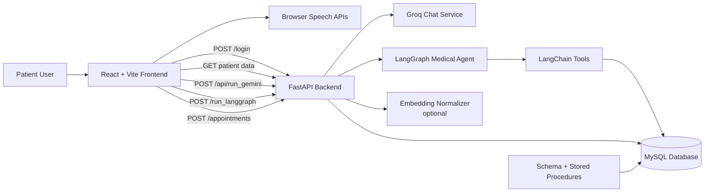
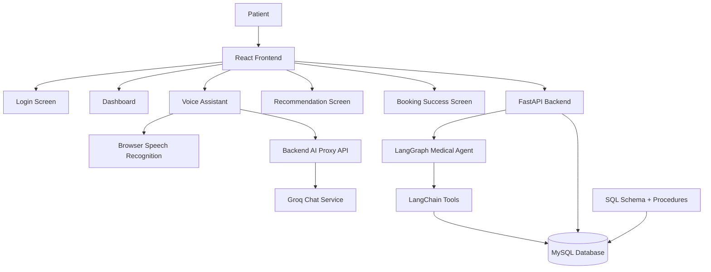
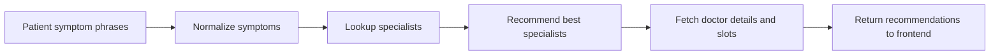
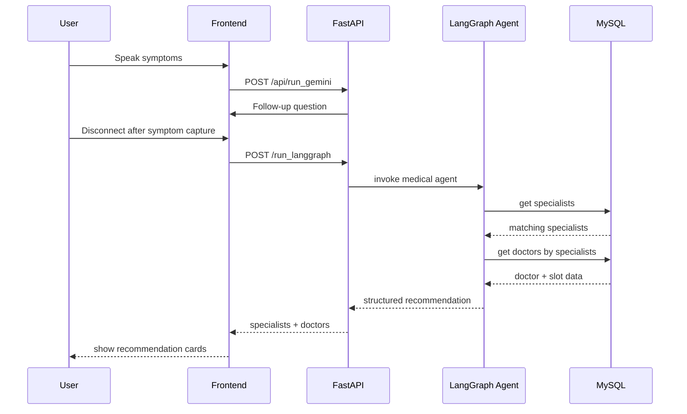
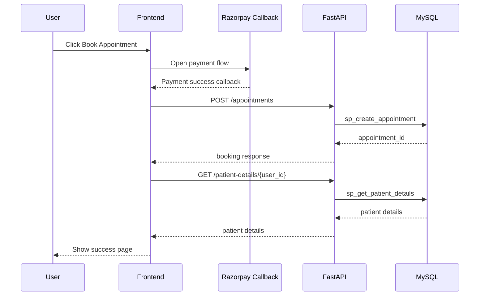

# MediFlow AI agents

MediFlow AI is a healthcare assistant that combines a React frontend, a FastAPI backend, a MySQL database, and an AI-driven symptom triage flow to help patients:

- log in and view their profile
- review medical history
- talk to a voice-enabled assistant
- convert symptom phrases into specialist recommendations
- view matching doctors and book an appointment

This repository is the single source of truth for the project and contains the application code, database scripts, API contract, architecture, and project documentation required for submission.

## Problem Statement

Patients often struggle to decide which specialist to consult, especially when symptoms are vague or described in everyday language. Traditional appointment flows also separate symptom capture, doctor discovery, and booking into multiple disconnected steps.

MediFlow AI reduces that friction by:

- collecting symptoms through a conversational assistant
- normalizing raw symptom phrases into structured terms
- mapping symptoms to specialists
- fetching relevant doctors and available slots
- allowing direct appointment booking from the recommendation screen

## Solution Overview

The system is built as a full-stack healthcare workflow:

- `frontend/` provides the login, dashboard, assistant, recommendation, and booking experience.
- `backend/` exposes REST APIs, runs the AI orchestration flow, and connects to MySQL stored procedures.
- `database/sql/` contains schema creation, seed data, and stored procedures.
- the AI layer uses a conversational model for follow-up questions and a LangGraph pipeline for specialist recommendation.

## Repository Structure

```text
MediFlowAI/
├── backend/
│   ├── agents/                 # LangGraph medical agent
│   ├── config/                 # Settings and logging
│   ├── models/                 # Pydantic request/response schemas
│   ├── routes/                 # FastAPI endpoints
│   ├── services/               # Database, Groq, embeddings
│   ├── tools/                  # LangChain tools for symptom/specialist lookup
│   ├── utils/                  # Text preprocessing helpers
│   ├── main.py                 # FastAPI app
│   └── requirements.txt
├── database/
│   └── sql/
│       ├── schema.sql          # Tables and seed data
│       └── functions/          # Stored procedures
├── frontend/
│   ├── public/
│   ├── src/
│   │   ├── components/         # Dashboard, assistant, recommendation, success
│   │   ├── context/            # Shared app state and voice handling
│   │   ├── assets/             # UI images
│   │   └── gemini.js           # Frontend AI proxy client
│   ├── package.json
│   └── vite.config.js
├── main.py                     # Root entry point for uvicorn
└── README.md
```

## Key Features

- Patient login using backend-authenticated credentials
- Patient dashboard with demographic data and medical history
- Voice-enabled assistant using the browser Speech Recognition API
- Conversational symptom collection through a backend AI endpoint
- LangGraph-based symptom-to-specialist recommendation flow
- Doctor recommendation cards with hospital, fee, rating, and next slot
- Appointment booking after payment gateway callback
- Automatic database bootstrap from SQL scripts on backend startup

## Architecture Diagram



## Diagrams

The repository now includes Mermaid diagrams directly in the README so they render on GitHub without requiring separate image files.

### 1. System Architecture



### 2. Agent Workflow



### 3. Recommendation Sequence



### 4. Appointment Booking Sequence



## End-to-End User Flow

1. The patient logs in from the home page.
2. The frontend stores `user_id` in `localStorage`.
3. The dashboard fetches patient details and medical history.
4. The patient opens the assistant and starts voice input.
5. The browser converts speech to text and sends prompts to the backend AI endpoint.
6. The backend AI service asks follow-up questions until enough symptoms are gathered.
7. On disconnect, the frontend sends collected symptom phrases to `/run_langgraph`.
8. The LangGraph pipeline normalizes symptoms, finds specialists, recommends specialists, and fetches doctors.
9. The frontend shows recommended specialists and available doctors.
10. After payment callback, the frontend creates an appointment and shows a confirmation screen.

## How the Agent Works

The project uses two AI-related flows.

### 1. Conversational Symptom Collection

The frontend sends prompts to `POST /api/run_gemini`, which is currently handled by the backend Groq service. The model is instructed to:

- ask one follow-up question at a time
- gather symptom details gradually
- avoid directly choosing a specialist
- tell the user when enough information has been collected

This flow is implemented in:

- `frontend/src/gemini.js`
- `backend/routes/ai.py`
- `backend/services/groq_service.py`

### 2. LangGraph Recommendation Pipeline

The backend medical agent in `backend/agents/medical_agent.py` builds a `StateGraph` with four sequential nodes:

1. `normalize`
2. `lookup_specialists`
3. `recommend_specialists`
4. `fetch_doctors`

The pipeline behavior is:

- `normalize`: tries LLM-based normalization first when an OpenAI key exists, otherwise falls back to a local normalization tool.
- `lookup_specialists`: queries MySQL using `sp_get_specialists`.
- `recommend_specialists`: narrows the list to the most suitable specialists.
- `fetch_doctors`: queries doctor and slot details using `sp_get_doctors_by_specialists`.

### Tooling Used by the Agent

The LangGraph flow uses LangChain tools defined in `backend/tools/medical_tools.py`:

- `normalize_symptoms`
- `lookup_specialists`
- `recommend_specialists`
- `fetch_doctor_details`

### Optional Embedding-Based Normalization

If `ENABLE_EMBEDDINGS=true`, the backend initializes a sentence-transformer model and FAISS index on startup. This powers the `/normalize` endpoint for similarity-based symptom matching. If embeddings are disabled or fail to initialize, the recommendation flow still works through the rule-based fallback.

## Tech Stack

### Frontend

- React
- Vite
- React Router
- Tailwind CSS
- Browser Speech Recognition API
- Browser Speech Synthesis API
- Razorpay checkout integration placeholder

### Backend

- Python
- FastAPI
- Uvicorn
- Pydantic
- MySQL Connector/Python
- LangChain
- LangGraph
- OpenAI client
- Groq client
- Sentence Transformers
- FAISS

### Database

- MySQL
- SQL schema bootstrap
- Stored procedures for app-facing data access

## Database Design Summary

The schema includes the following main entities:

- `users`
- `patients`
- `patient_history`
- `hospitals`
- `doctors`
- `availability_slots`
- `appointments`
- `reviews`
- `visits`
- `specialists`
- `symptoms`
- `specialist_symptom`

Seed data is included in `database/sql/schema.sql` for demo purposes.

### Important Stored Procedures

- `sp_login_user`
- `sp_get_patient_id`
- `sp_get_patient_details`
- `sp_get_medical_history`
- `sp_get_specialists`
- `sp_get_doctors_by_specialists`
- `sp_create_appointment`

On backend startup, `run_all_sql_files()` attempts to:

- execute `schema.sql`
- create all stored procedures in `database/sql/functions/`

## API Documentation

Base URL for local backend:

```text
http://localhost:8000
```

### `GET /`

Returns a welcome message.

Example response:

```json
{
  "message": "Welcome to the Healthcare Agent API!"
}
```

### `GET /health`

Returns backend health information.

Example response:

```json
{
  "status": "ok",
  "app": "MediFlow Healthcare Agent API",
  "database_configured": true
}
```

### `POST /login`

Authenticates a patient user.

Request:

```json
{
  "email": "ram@gmail.com",
  "password": "1234"
}
```

Response:

```json
{
  "message": "Login successful",
  "user_id": 2
}
```

### `GET /patient-details/{user_id}`

Fetches the patient profile linked to the given user.

### `GET /medical-history/{user_id}`

Fetches the medical history record linked to the given user.

### `POST /api/run_gemini`

Proxy endpoint used by the frontend chat flow.

Important note:

- the frontend calls this endpoint as a Gemini-style proxy
- the backend currently serves it through the Groq service
- `POST /api/run_groq` is routed to the same handler

Request:

```json
{
  "prompt": "I have chest pain and mild fever",
  "history": [
    "User: I have chest pain",
    "Agent: When did it start?"
  ]
}
```

Response:

```json
{
  "text": "Do you also feel shortness of breath or tightness in the chest?",
  "raw": null
}
```

### `POST /run_langgraph`

Runs the recommendation pipeline.

Request:

```json
{
  "phrases": [
    "I have chest pain",
    "I also feel feverish"
  ]
}
```

Response:

```json
{
  "phrases": [
    "I have chest pain",
    "I also feel feverish"
  ],
  "normalized_symptoms": [
    "Chest Pain",
    "Fever"
  ],
  "specialists": [
    "Cardiologist",
    "Physician"
  ],
  "recommended_specialists": [
    "Cardiologist",
    "Physician"
  ],
  "doctors": [
    {
      "doctor_id": 1,
      "name": "Dr Amit",
      "specialization": "Cardiologist",
      "rating": 4.5,
      "fees": 500,
      "hospital": "City Hospital",
      "next_available_date": "2026-05-10",
      "start_time": "10:00:00",
      "end_time": "12:00:00",
      "slot_id": 1
    }
  ]
}
```

### `POST /normalize`

Runs embedding-based normalization when embeddings are enabled and initialized.

Request:

```json
{
  "phrases": [
    "pain in chest",
    "high temperature"
  ]
}
```

### `POST /appointments`

Creates an appointment after payment completion.

Request:

```json
{
  "patient_id": 2,
  "doctor_id": 1,
  "slot_id": 1,
  "reason": "Booked via AI Assistant"
}
```

Response:

```json
{
  "message": "Appointment created",
  "appointment_id": 4
}
```

## Setup Instructions

## Prerequisites

- Python 3.11 or newer
- Node.js 20 or newer
- npm
- MySQL Server

## 1. Clone the Repository

```bash
git clone <your-repo-url>
cd MediFlowAI
```

## 2. Backend Setup

Create and activate a virtual environment, then install Python dependencies.

Windows PowerShell:

```powershell
python -m venv .venv
.venv\Scripts\Activate.ps1
pip install -r backend\requirements.txt
```

Run the API:

```powershell
uvicorn main:app --reload
```

The backend starts on:

```text
http://127.0.0.1:8000
```

## 3. Backend Environment Variables

Create `backend/.env` with values like:

```env
APP_NAME=MediFlow Healthcare Agent API
LOG_LEVEL=INFO
FRONTEND_ORIGIN=http://localhost:5173

DB_HOST=localhost
DB_PORT=3306
DB_USER=root
DB_PASSWORD=your_password
DB_NAME=healthcare

GROQ_API_KEY=your_groq_api_key
GROQ_MODEL=llama-3.1-8b-instant

OPENAI_API_KEY=
OPENAI_MODEL=gpt-4o-mini

ENABLE_EMBEDDINGS=false
EMBEDDING_MODEL_NAME=all-MiniLM-L6-v2
```

Notes:

- the database must exist before the backend can bootstrap its schema
- startup attempts to execute SQL files automatically
- `OPENAI_API_KEY` is optional for LLM-based normalization
- `ENABLE_EMBEDDINGS=true` requires the embedding stack to install successfully

## 4. Database Setup

Create the MySQL database manually before starting the backend:

```sql
CREATE DATABASE healthcare;
```

Then start the backend. It will attempt to run:

- `database/sql/schema.sql`
- all procedures in `database/sql/functions/`

Demo credentials seeded in the schema include:

```text
ram@gmail.com / 1234
rohan@gmail.com / 1234
```

## 5. Frontend Setup

Install dependencies and run the development server:

```bash
cd frontend
npm install
npm run dev
```

The frontend runs on:

```text
http://localhost:5173
```

## 6. Frontend Environment Variables

Create `frontend/.env`:

```env
VITE_BACKEND_URL=http://localhost:8000
```

## Troubleshooting

### Vite Native Binding Error

If `npm run dev` fails with a `rolldown` native binding error on Windows, reinstall frontend dependencies cleanly:

```powershell
Remove-Item -Recurse -Force node_modules
Remove-Item -Force package-lock.json
npm install
npm run dev
```

### Microphone Access Error

If speech recognition shows `not-allowed`:

- allow microphone access in the browser
- run the app from `localhost`
- reload after granting permission

### Python Dependency Interruptions

If `pip install -r backend/requirements.txt` was interrupted, rerun it in the same virtual environment until all required packages are installed.

## Test Cases

At the time of this README, the repository does not contain an automated test suite under a dedicated `tests/` directory. Current validation is primarily manual and API-based.

### Manual Test Coverage

1. Login flow
   Expected result: valid seeded credentials return `user_id` and navigate to dashboard.
2. Dashboard load
   Expected result: patient demographics and medical history load from backend APIs.
3. Voice assistant start
   Expected result: browser requests microphone permission and updates assistant status.
4. AI symptom chat
   Expected result: backend returns one follow-up response at a time.
5. LangGraph recommendation
   Expected result: symptom phrases map to recommended specialists and doctor cards.
6. Appointment booking
   Expected result: appointment record is inserted and confirmation page is shown.

### Recommended Future Automated Tests

- FastAPI route tests for auth, patients, AI, and appointments
- unit tests for `normalize_symptoms`
- integration tests for `run_medical_agent`
- database procedure validation tests
- frontend component tests for dashboard and recommendation flows

## Design Assets

The repository includes UI assets used in the frontend:

- `frontend/src/assets/assistant.jpg`
- `frontend/src/assets/hero.png`
- `frontend/src/assets/react.svg`
- `frontend/src/assets/vite.svg`
- `frontend/public/favicon.svg`
- `frontend/public/icons.svg`

## Deployment

Live application link:

```text
Not deployed yet
```

If the project is deployed later, add the production URL here.

## Demo Video

Demo video link:

```text
Add your 5-minute demo video link here
```

Suggested demo outline:

1. Problem statement
2. Solution overview
3. Login and dashboard walkthrough
4. Voice assistant symptom collection
5. Recommendation and booking flow
6. Brief architecture explanation

## Known Limitations

- frontend voice recognition depends on browser support and user microphone permission
- payment flow contains a Razorpay placeholder key and requires real integration setup
- no automated tests are currently checked into the repository
- some AI naming is legacy: the frontend calls a Gemini-named endpoint that is currently backed by Groq
- the specialist recommendation logic is intentionally simple and currently returns the first matching specialists

## Submission Checklist

- complete codebase included in repository
- README with setup instructions
- architecture diagram included
- explanation of agent workflow included
- API documentation included
- test-case section included
- design assets listed
- live link section included
- demo video placeholder included

## Future Improvements

- add JWT-based authentication instead of plain credential validation
- hash passwords in the database
- add a proper appointment status and slot-locking workflow
- improve specialist ranking with richer symptom ontology
- add automated tests and CI
- deploy frontend and backend with environment-specific configs
